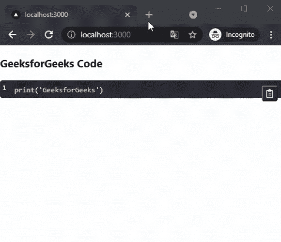

# 如何在 Next.js 中添加 CodeBlock？

> 原文:[https://www . geesforgeks . org/how-add-codeblock-in-next-js/](https://www.geeksforgeeks.org/how-to-add-codeblock-in-next-js/)

在本文中，我们将学习如何在 NextJS 中添加 CodeBlock。NextJS 是一个基于 React 的框架。它有能力为不同的平台开发漂亮的网络应用程序，如视窗、Linux 和 mac。动态路径的链接有助于有条件地呈现您的 NextJS 组件。

**方法:**要添加我们的代码块，我们将使用反应代码块包。react-code-blocks 包帮助我们在应用程序的任何地方添加 CodeBlock。首先，我们将安装 react-code-blocks 包，然后我们将在主页上添加一个 codeblock。

**创建 NextJS 应用程序:**您可以使用以下命令创建一个新的 NextJs 项目:

```
npx create-next-app gfg
```

**安装所需的包:**现在我们将使用以下命令安装反应代码块包:

```
npm i react-code-blocks
```

**项目结构:**会是这样的。


**添加时钟:**我们可以在安装了 react-code-blocks 包后，在我们的应用程序中轻松添加 codeblock。对于这个例子，我们将把代码块添加到我们的主页。

在 **index.js** 文件中添加以下内容:

## java 描述语言

```
import React from "react";
import { CopyBlock,dracula } from "react-code-blocks";

export default function CodeBlockk() {
  return (
    <div>
      <h3>GeeksforGeeks Code</h3>
      <CopyBlock
      text="print('GeeksforGeeks')"
      language='python'
      showLineNumbers='true'
      wrapLines
      theme={dracula}
    />
    </div>
  );
}
```

**说明:**首先在上面的例子中，我们是从已安装的包中导入 CopyBlock 组件。之后，我们将在我们的 CopyBlock 组件中添加文本、语言和其他参数。

**运行应用的步骤:**在终端运行下面的命令运行应用。

```
npm run dev
```

### 输出:

