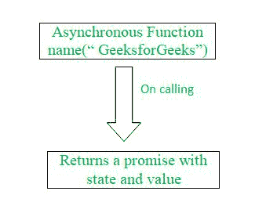

# 如何在 JavaScript 中将异步函数转换为返回承诺？

> 原文:[https://www . geesforgeks . org/如何将异步函数转换为 javascript 中的返回承诺/](https://www.geeksforgeeks.org/how-to-convert-an-asynchronous-function-to-return-a-promise-in-javascript/)

在本文中，我们将学习如何在 JavaScript 中转换异步函数来返回[承诺。](https://www.geeksforgeeks.org/javascript-promises/)

**方法:**首先需要声明一个简单的函数(可以是普通函数，也可以是箭头函数(首选))。您需要创建一个异步函数，然后您需要将承诺作为该异步函数的输出返回。

让我们借助下面的图画来理解。

我们需要创建一个函数(方法)，要么是一个简单的函数，要么是一个箭头函数(我们正在使用箭头函数分析事实)。创建一个异步函数，然后在调用该函数时，我们应该以承诺的形式返回输出。

让我们首先了解如何在 JavaScript 中声明一个简单的箭头函数，并在控制台中返回与该函数相关联的结果。

**示例:**

| `` |