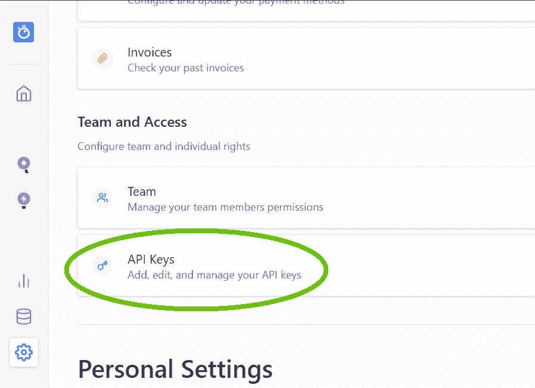
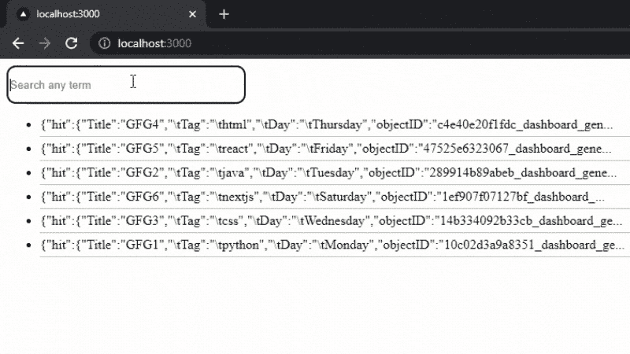

# 如何在 Next.js

中自定义搜索栏

> 原文:[https://www . geesforgeks . org/how-customize-search-bar-in-next-js/](https://www.geeksforgeeks.org/how-to-customize-search-bar-in-next-js/)

在本文中，我们将学习如何使用 Algolia 在 NextJS 项目中添加定制的搜索栏。NextJS 是一个基于 React 的框架。它有能力为不同的平台开发漂亮的网络应用程序，如视窗、Linux 和 mac。动态路径的链接有助于有条件地呈现您的 NextJS 组件。

**方法:**首先添加我们定制的搜索栏，我们将在 algolia 创建一个帐户，使我们能够在几毫秒内搜索内容。之后，我们将获得我们稍后将在应用程序中使用的应用编程接口密钥。然后我们将创建一个新的索引来上传我们的数据。在我们应用的主页上，我们将使用 API 键和 algoliasearch 模块从 algolia 获取数据。然后我们将创建我们定制的搜索栏。

### 创建下一个应用程序:

**步骤 1:** 您可以使用以下命令创建一个新的 NextJs 项目:

```
npx create-next-app gfg
```

**步骤 2:** 为了在我们的项目中添加 Algolia 搜索，我们将安装两个模块:

```
npm install algoliasearch react-instantsearch-dom
```

**项目结构:**如下图。


**第三步:设置 Algolia。** Algolia 使开发人员能够构建下一代应用程序，其 API 可以在几毫秒内交付相关内容。所以要使用 algolia，首先创建一个免费账户，并获取该账户的 API 密钥。

1.获取应用编程接口密钥转到**设置** > **应用编程接口密钥**



2.之后，创建一个索引并上传您想要搜索的数据。您可以以 json、csv 格式或使用它们的 API 上传数据。


对于这个例子，我正在上传下面的数据。

```
Title, Tag, Day
GFG1, python, Monday
GFG2, java, Tuesday
GFG3, css, Wednesday
GFG4, html, Thursday
GFG5, react, Friday
GFG6, nextjs, Saturday
```


**第 4 步:**现在我们将为我们的应用程序创建一个自定义搜索栏。为此，我们将在新的组件文件夹中创建一个新文件，内容如下。

## java 描述语言

```
import { connectSearchBox } from 'react-instantsearch-dom';

function SearchBar({ currentRefinement, isSearchStalled, refine }) {

  return (

      <form noValidate action="" role="search">
        <input
          value={currentRefinement}
          onChange={event => refine(event.currentTarget.value)}
          placeholder="Search any term"
          style={{ height:'40px',width:'280px',borderRadius:"10px"}}
          title='Search bar'
        />
       </form>

  )
}

export default connectSearchBox(SearchBar);
```

**第五步:**现在我们可以使用 API 在 NextJs Project 中添加自定义搜索了。之后，为了使用我们定制的搜索栏，我们将在 index.js 文件中添加下面的代码。

## java 描述语言

```
// Importing modules
import algoliasearch from "algoliasearch/lite";
import { InstantSearch, SearchBox, Hits } 
    from "react-instantsearch-dom";
import SearchBar from "../component/CustomSearch";

const searchClient = algoliasearch(
  APPLICATION_API_KEY,
  SEARCH_ONLY_API_KEY,
);

export default function CustomizedSearch() {
  return (
    <>
      <InstantSearch 
        searchClient={searchClient} 
        indexName="gfg_dev">

        {/* Adding Search Box */}
        <SearchBar/>

        {/* Adding Data */}
        <Hits />
      </InstantSearch>
    </>
  );
}
```

您也可以在我们的自定义搜索栏中使用 CSS 添加样式。

**运行应用的步骤:**在终端使用下面的命令运行应用。

```
npm run dev
```

### 输出:

