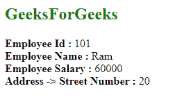

# 如何使用 JavaScript 过滤嵌套的 JSON 对象返回一定的值？

> 原文:[https://www . geesforgeks . org/如何使用 javascript 过滤嵌套 json 对象以返回特定值/](https://www.geeksforgeeks.org/how-to-filter-nested-json-object-to-return-certain-value-using-javascript/)

给定包含在组织中工作的员工的详细信息的集合。我们需要从这些嵌套的细节集合中找到一些值。该集合称为 JSON 对象，对象内部的信息称为嵌套 JSON 对象。

**示例 1:** 我们使用 JavaScript 代码创建嵌套的 JSON 对象。考虑一个例子，假设有 4 个员工的详细信息，我们需要找到第一个员工的街道号码，然后可以通过以下方式完成。

```html
employees[0].address.["street-no"] 
```

如果我们需要找到第二名员工的居住细节，请使用以下说明。

```html
employees[1].address.["street-no"]
```

**注意:**点是一个运算符，表示从第一个员工的地址字段中选择街道号码。“街道号”在“地址”内，所以使用点运算符。

要在文档中打印上述结果，我们需要使用 *document.write*

## 超文本标记语言

```html
<!DOCTYPE html>
<html>

<body>
    <h2 style="color:green;">
        GeeksForGeeks
    </h2>

    <script>
        var employees = [
        {
            "emp_id":101,
            "empname":"Ram",
            "salary":60000,
            "address" : 
            {
                "street-no":20,
                "plot-no":121,
                "city":"pune",
                "contact" : 
                {
                    "landline" : 2292099,
                    "mobile" : 8907632178
                }
            }
        },
        {
            "emp_id":102,
            "empname":"Shyam",
            "salary":50000,
            "address" : 
            {
                "street-no":12,
                "plot-no":221,
                "city":"pune"
            }
        },
        {
            "emp_id":103,
            "empname":"Lakhan",
            "salary":40000,
            "address" : 
            {
                "street-no":11,
                "plot-no":432,
                "city":"pune"
            }
        },
        {
            "emp_id":104,
            "empname":"Snigdha",
            "salary":60000,
            "address" : 
            {
                "street-no":21,
                "plot-no":222,
                "city":"pune"
            }
        }]

        document.write("<b>" + "Employee Id : "
            + "</b>" + employees[0].emp_id + "<br>");

        document.write("<b>" + "Employee Name : " 
            + "</b>" + employees[0].empname + "<br>");

        document.write("<b>" + "Employee Salary : "
            + "</b>" + employees[0].salary + "<br>");

        document.write("<b>" + "Address -> " 
            + "Street Number : " + "</b>" +
            employees[0].address["street-no"]);
    </script>
</body>

</html>
```

**输出:**



**示例 2:** 我们需要使用 JavaScript 创建嵌套的 JSON 对象。考虑一个包含 4 名员工信息的示例，我们需要找到第一名员工的手机号码，然后可以通过以下方式完成。

```html
employees[0].address.contact["mobile"]
```

找到第二个员工的联系方式。

```html
employees[1].address.contact["mobile"]
```

点运算符用于从第二个员工的地址字段的联系人字段中选择手机。

## 超文本标记语言

```html
<!DOCTYPE html>
<html>

<body>
    <h2 style="color: green;">
        GeeksForGeeks
    </h2>
    <script>
        var employees = [
        {
            "emp_id":101,
            "empname":"Ram",
            "salary":60000,
            "address" : 
            {
                "street-no":20,
                "plot-no":121,
                "city":"pune",
                "contact" : 
                {
                    "landline" : 2292099,
                    "mobile" : 8907632178
                }
            }
        },
        {
            "emp_id":102,
            "empname":"Shyam",
            "salary":50000,
            "address" : 
            {
                "street-no":12,
                "plot-no":221,
                "city":"pune"
            }
        },
        {
            "emp_id":103,
            "empname":"Lakhan",
            "salary":40000,
            "address" : 
            {
                "street-no":11,
                "plot-no":432,
                "city":"pune"
            }
        },
        {
            "emp_id":104,
            "empname":"Snigdha",
            "salary":60000,
            "address" : 
            {
                "street-no":21,
                "plot-no":222,
                "city":"pune"
            }
        }]

        document.write("<b>" + "Employee Id : "
            + "</b>" + employees[0].emp_id + "<br>");

        document.write("<b>" + "Employee Name : " 
            + "</b>" + employees[0].empname + "<br>");

        document.write("<b>" + "Employee Salary : " 
            + "</b>" + employees[0].salary + "<br>");

        document.write("<b>" + "Address -> " 
            + "Street Number : " + "</b>"
            + employees[0].address["street-no"] + "<br>");

        document.write("<b>" + "Address -> " 
            + "Phone Number -> " + "</b>"
            + "<b>" + "Mobile : " + "</b>"
            + employees[0].address.contact["mobile"]
            + "<br>");
    </script>
</body>

</html>
```