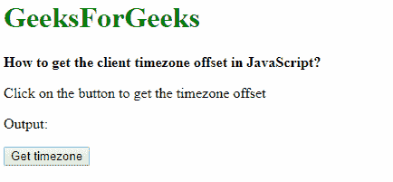
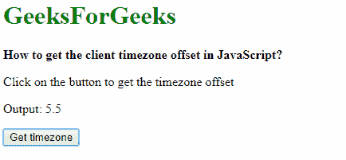

# 如何在 JavaScript 中获取客户端时区偏移量？

> 原文:[https://www . geesforgeks . org/如何获取客户端时区-javascript 中的偏移量/](https://www.geeksforgeeks.org/how-to-get-the-client-timezone-offset-in-javascript/)

使用日期对象的 getTimezoneOffset()方法可以检测到客户端的时区偏移量。

getTimezoneOffset()方法返回 UTC 时间和本地时间之间的时间差，即时间偏移，以分钟为单位。通过除以 60 并否定结果来改变该偏移量。

**注意:**getTimezoneOffset()不考虑夏令时，因此该值可能不是常数。

**语法:**

```
offset = new Date().getTimezoneOffset()
```

**示例:**

```
<!DOCTYPE html>
<html>

<head>
    <title>
        How to get the client timezone
        offset in JavaScript?
    </title>
</head>

<body>
    <h1 style="color: green">
        GeeksForGeeks
    </h1>

    <b>
        How to get the client timezone
        offset in JavaScript?
    </b>

    <p>
        Click on the button to get
        the timezone offset
    </p>

    <p>Output: <span class="output"></span></p>

    <button onclick="getTimezone()">
        Get timezone
    </button>

    <!-- Script to get the client timezone -->
    <script type="text/javascript">
        function getTimezone() {
            offset = new Date().getTimezoneOffset();
            formatted = -(offset / 60);
            document.querySelector('.output').textContent
                    = formatted;
        }
    </script>
</body>

</html>                    
```

**输出:**

*   **点击按钮前:** 
*   **点击按钮后:** 