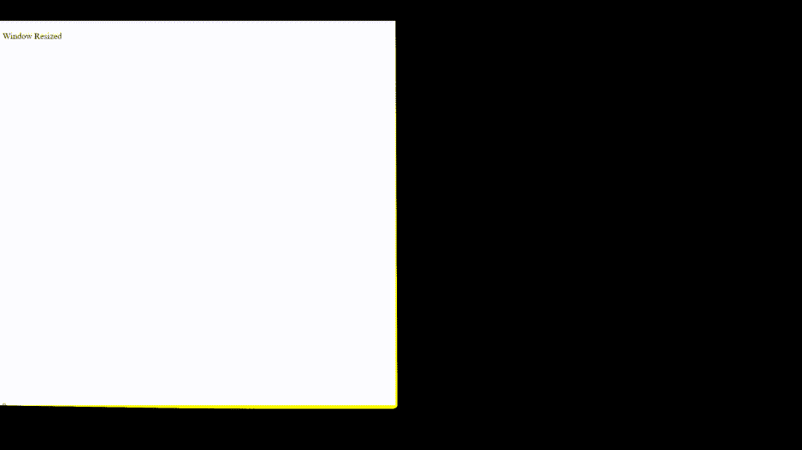

# 如何等待调整大小结束事件，然后使用 JavaScript 执行一个动作？

> 原文:[https://www . geesforgeks . org/how-wait-resize-end-event-然后-执行-a-action-use-JavaScript/](https://www.geeksforgeeks.org/how-to-wait-resize-end-event-and-then-perform-an-action-using-javascript/)

当我们调整浏览器窗口大小时，“调整大小”事件会连续触发，在调整大小时会触发多次。我们希望“调整大小”事件只在我们完成调整大小时触发。
**先决条件:**要解决这个问题，我们使用两个函数:

*   [setTimeout()功能](https://www.geeksforgeeks.org/java-script-settimeout-setinterval-method/)
*   [clearTimeOut()功能](https://www.geeksforgeeks.org/javascript-cleartimeout-clearinterval-method/)

**示例:**我们将使用 **setTimeout()** 让它们在调整大小等待 500ms 后我们想要被激发的功能。现在，我们在“调整大小”事件中保留 setTimeout()函数。就在**设置超时()**之前，我们设置了**清除超时()**，这将持续清除该设置超时()计时器。因为，当我们调整窗口大小时，resize 事件被连续激发，因此 **clearTimeOut()** 也被连续调用。因此，在我们停止调整大小之前，setTimeout()中的函数不会运行。

*   **HTML 代码:**

## 超文本标记语言

```
<!DOCTYPE html>

<html lang="en">
<head>
    <meta charset="utf-8" />
    <title></title>
</head>

<body>
    <!-- div is used to display a message
         when we are done resizing -->
    <div id="message"></div>
</body>

</html>
```

*   **Javascript 代码:**

## java 描述语言

```
    <script>

        // Message variable contains the div object which
        // is used to display message after we are done resizing
        var message = document.getElementById("message");

        // timeOutFunctionId stores a numeric ID which is
        // used by clearTimeOut to reset timer
        var timeOutFunctionId;

        // The function that we want to execute after
        // we are done resizing
        function workAfterResizeIsDone() {
            message.innerHTML += "
<p>Window Resized</p>
";
        }

        // The following event is triggered continuously
        // while we are resizing the window
        window.addEventListener("resize", function() {

            // clearTimeOut() resets the setTimeOut() timer
            // due to this the function in setTimeout() is
            // fired after we are done resizing
            clearTimeout(timeOutFunctionId);

            // setTimeout returns the numeric ID which is used by
            // clearTimeOut to reset the timer
            timeOutFunctionId = setTimeout(workAfterResizeIsDone, 500);
        });
    </script>
```

**最终解决方案:**在本节中，我们将结合以上两个部分来执行任务。

*   **节目:**

## 超文本标记语言

```
<!DOCTYPE html>

<html lang="en">

<head>
    <meta charset="utf-8" />
    <title></title>
</head>

<body>
    <!-- div is used to display a message
         when we are done resizing -->
    <div id="message"></div>

    <script>

        // Message variable contains the div object which
        // is used to display message after we are done resizing
        var message = document.getElementById("message");

        // timeOutFunctionId stores a numeric ID which is
        // used by clearTimeOut to reset timer
        var timeOutFunctionId;

        // The function that we want to execute after
        // we are done resizing
        function workAfterResizeIsDone() {
            message.innerHTML += "
<p>Window Resized</p>
";
        }

        // The following event is triggered continuously
        // while we are resizing the window
        window.addEventListener("resize", function() {

            // clearTimeOut() resets the setTimeOut() timer
            // due to this the function in setTimeout() is
            // fired after we are done resizing
            clearTimeout(timeOutFunctionId);

            // setTimeout returns the numeric ID which is used by
            // clearTimeOut to reset the timer
            timeOutFunctionId = setTimeout(workAfterResizeIsDone, 500);
        });
    </script>
</body>

</html>
```

*   **输出:**



**注意:**在我们完成调整大小后，代码将等待 500 毫秒，以在我们完成调整大小后启动我们想要运行的功能，