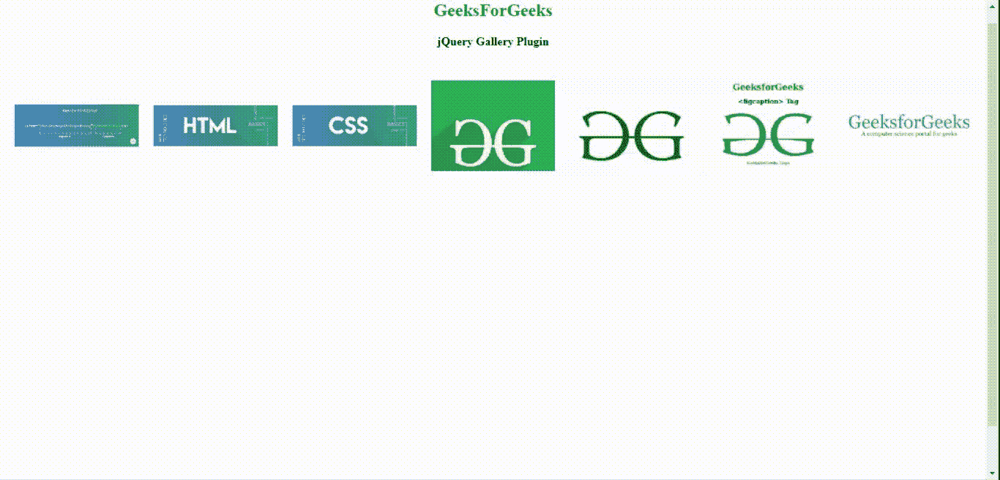
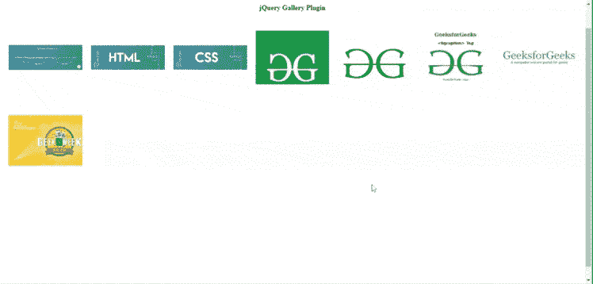

# JavaScript 库插件

> 原文:[https://www.geeksforgeeks.org/javascript-gallery-plugin/](https://www.geeksforgeeks.org/javascript-gallery-plugin/)

在本文中，我们将学习如何使用 JavaScript **图库**插件实现图像图库功能。这个插件重量很轻，本质上反应灵敏，有助于开发者管理照片库。

**注意:**请下载工作文件夹中的 JavaScript [**图库**](https://github.com/bendc/gallery) 插件，并在你的 HTML 代码头部包含所需文件。

> <link href="”style.css”" rel="”stylesheet”" type="”text/css”/">
> <脚本 src = " app . js "></脚本>

**示例:**以下示例演示了一个使用 JavaScript Gallery 插件的图像库。图库中的每个图像都很容易切换。开发人员需要在存储“JPG”或“巴布亚新几内亚”图像文件的工作文件夹中创建一个“图像”文件夹。稍后可以在此文件夹中添加更多图像。

## 超文本标记语言

```
<!DOCTYPE html>

<html lang="en">
<meta charset="utf-8">
<meta name="viewport" content=
    "initial-scale=1, width=device-width">

<head>
    <link rel="stylesheet" href="style.css">
    <script src="app.js" type="module"></script>
    <title>JavaScript Gallery Plugin</title>
    <style>
        body {
            text-align: center;
        }
    </style>
</head>

<body>
    <h2 style="color:green">GeeksForGeeks</h2>
    <b>JavaScript Gallery Plugin</b>
    <template>
        <li>
            
        </li>
    </template>
</body>

</html>
```

**images.js** 上面的 HTML 代码中使用了这个 JavaScript 文件，其中保存了如下所示的所有图像名称。

```
export default [
  "background1.jpg",
  "background2.jpg",
  "background3.jpg",
  "geeksimage1.png",
  "geeksimage2.png",
  "geeksimage3.png",
  "gfg1.png" 
];
```

**输出:**



如果用户想在图库中添加更多图像，应该添加新的图像名称，如下面的代码所示。例如，“gfg2.jpg”是添加到“images”文件夹和以下代码中的文件。

```
export default [
  "background1.jpg",
  "background2.jpg",
  "background3.jpg",
  "geeksimage1.png",
  "geeksimage2.png",
  "geeksimage3.png",
  "gfg1.png",
  "gfg2.jpg" 
];
```

**输出:**以下输出显示了插件的响应特性。

