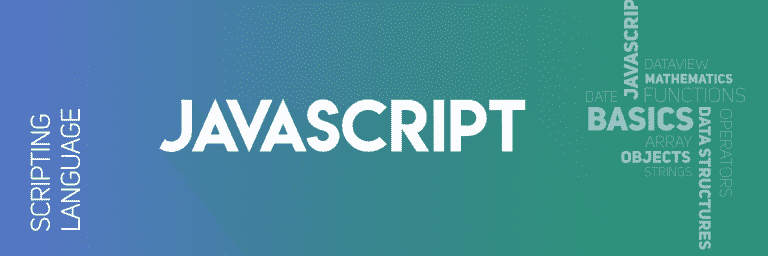

# JavaScript 面试问答|第三集

> 原文:[https://www . geesforgeks . org/JavaScript-面试-问答-set-3/](https://www.geeksforgeeks.org/javascript-interview-questions-and-answers-set-3/)


我们已经讨论过一些基于 JavaScript 的面试问题。

*   [JavaScript 面试问答|第 1 集](https://www.geeksforgeeks.org/javascript-interview-questions-and-answers/)
*   [JavaScript 面试问答|第 2 集](https://www.geeksforgeeks.org/javascript-interview-questions-and-answers-set-2/)

以下是一些更相关的问题:

1.  **[What is the ‘Strict’ mode in JavaScript and how can it be enabled?](https://www.geeksforgeeks.org/strict-mode-javascript/)**
    Strict Mode is a new feature in ECMAScript 5 that allows you to place a program or a function in a “strict” operating context. This strict context prevents certain actions from being taken and throws more exceptions. The statement “use strict” instructs the browser to use the Strict mode, which is a reduced and safer feature set of JavaScript.
2.  **[如何获取 CheckBox 的状态？](https://www.geeksforgeeks.org/html-dom-input-checkbox-checked-property/)**
    DOM 输入复选框属性用于设置或返回复选框字段的选中状态。该属性用于反映 HTML Checked 属性。

```
document.getElementById("GFG").checked;
```

如果复选框被选中，则返回真。

*   **[How to explain closures in JavaScript and when to use it ?](https://www.geeksforgeeks.org/closure-in-javascript/)**
    The closure is created when a child functions to keep the environment of the parent’s scope even after the parent’s function has already executed. The Closure is a locally declared variable related to a function. The closure will provide better control over the code when using them.

    ```
    // Explanation of closure 
    function foo() { 
        var b = 1; 
        function inner() { 
            return b; 
        } 
        return inner; 
    } 
    var get_func_inner = foo();         

    console.log(get_func_inner()); 
    console.log(get_func_inner()); 
    console.log(get_func_inner()); 
    ```

    *   **[What is the difference between call() and apply() methods ?](https://www.geeksforgeeks.org/what-is-the-difference-between-call-and-apply-in-javascript/)**
    Both methods are used in a different situation
    *   **调用()方法:**它调用方法，以所有者对象为参数。关键字这指的是函数或其所属对象的“所有者”。我们可以调用一个可以在不同对象上使用的方法。
    *   **apply()方法:**apply()方法用于编写方法，可以在不同的对象上使用。它不同于函数调用()，因为它将参数作为数组。*   **[How to target a particular frame from a hyperlink in JavaScript ?](https://www.geeksforgeeks.org/how-can-a-particular-frame-be-targeted-from-a-hyperlink-in-javascript/)**
    This can be done by using the **target** attribute in the hyperlink. Like

    ```
    <a href="/geeksforgeeks.htm" target="newframe">New Page</a>
    ```

    *   **[Write the errors shown in JavaScript ?](https://www.geeksforgeeks.org/javascript-error-and-exceptional-handling-with-examples/)**
    There are three different types of errors in javaScript.

    *   **语法错误:**语法错误是打算用特定编程语言编写的字符或标记序列的语法错误。
    *   **逻辑错误:**这是最难跟踪的错误，因为它是编码逻辑部分的错误，或者逻辑错误是程序中的一个错误，导致操作不正确和异常终止。
    *   **运行时错误:**运行时错误是程序运行过程中发生的错误，也称为异常。*   **What is the difference between JavaScript and Jscript ?**
    **JavaScript:**
    *   它是由网景公司开发的脚本语言。
    *   它用于设计客户端和服务器端应用程序。
    *   它完全独立于 Java 语言。

    **Jscript:**

    *   它是微软开发的脚本语言。
    *   它用于为万维网设计活跃的在线内容。*   **What does *var myArray = [[]];* statement declares ?**
    In JavaScript, this statement is used to declare a two-dimensional array.*   **How many ways an HTML element can be accessed in a JavaScript code ?**
    There are four possible ways to access HTML element in JavaScript which are:
    *   **[getElementById()方法:](https://www.geeksforgeeks.org/html-dom-getelementbyid-method/)** 用于通过元素的 Id 名称来获取元素。
    *   **[getElementsByClass()方法:](https://www.geeksforgeeks.org/html-dom-getelementsbyclassname-method/)** 用于获取所有具有给定类名的元素。
    *   **[getElementsByTagName()方法:](https://www.geeksforgeeks.org/html-dom-getelementsbytagname-method/)** 用于获取所有具有给定标签名的元素。
    *   **[querySelector()方法:](https://www.geeksforgeeks.org/html-dom-queryselector-method/)** 这个函数取 css 样式选择器，返回第一个选中的元素。*   **[What is the difference between innerHTML & innerText ?](https://www.geeksforgeeks.org/difference-between-innertext-and-innerhtml/)**
    The innerText property sets or returns the text content as plain text of the specified node, and all its descendants whereas the innerHTML property sets or returns the plain text or HTML contents in the elements. Unlike innerText, inner HTML lets you work with HTML rich text and doesn’t automatically encode and decode text.*   **[What is an event bubbling in JavaScript ?](https://www.geeksforgeeks.org/html-bubbles-event-property/)**
    Consider a situation an element is present inside another element and both of them handle an event. When an event occurs in bubbling, the innermost element handles the event first, then outer, and so on.*   **What will be the output of the following code ?**

    ```
    var X = { geeks : 1}; 
    var Output = (function() { 
        delete X.geeks; 
        return X.geeks; 
    })(); 

    console.log(output);
    ```

    这里的删除将删除对象的属性。X 是带有极客属性的对象，它是一个自调用函数，将从对象 X 中删除极客属性，因此结果将是未定义的。

    *   **How are JavaScript and ECMA Script related ?**
    The JavaScript is the main language that has to maintain some rules and regulation that is ECMA Script, that rules also bring new features for the language JavaScript.*   **How to hide JavaScript code from old browsers that don’t support JavaScript ?**
    To hide the JavaScript codes from the old browsers that don’t support JavaScript you can use

    ```
    <!-- before <script> tag and another //--> after </script> tag
    ```

    所有的旧浏览器都会把它当成 HTML 的长注释。支持 JavaScripts 的新浏览器会把它作为在线评论。

    *   **What will be the output of the following code ?**

    ```
    var output = (function(x) {
        delete x;
        return x;
    })(0);

    document.write(output);
    ```

    输出将为 0。删除运算符用于删除对象的运算符，但 X 不是对象，它是一个局部变量。delete 运算符不影响局部变量。

    *   **In JavaScript, answer if the following expressions result in true or false.**

    ```
    "0" == 0   // true or false ? 
    "" == 0   // true or false ? 
    "" == "0"   // true or false ?
    ```

    *   第一和第二种情况的结果将是**真**，第三种情况的结果将是**假**。*   **How to use any browser for debugging ?**
    By pressing the F12 we can trigger the debugging mode of any browser and can view the result by taping the console.*   **What is javascript Hoisting ?**
    When any interpreter runs the code then all the variables re-hoisted to the top of the original scope. This method is applicable for declaration not for the initialization of a variable. This is known as a javascript Hoisting.*   **What is the syntax of ‘Self Invoking Function’ ?**
    The syntax for Self INvoking Function: The last bracket contains the function expression.

    ```
    (function () {
        return () 
    } () ;
    ```

    *   **[如何在另一个 JavaScript 文件中使用外部 JavaScript 文件？](https://www.geeksforgeeks.org/how-to-include-a-javascript-file-in-another-javascript-file/)**
    你可以用下面的代码把外部使用的 JavaScript 代码转换成另一个 JavaScript 文件。

    ```
    <script type="text/javascript">
        var script = document.createElement('script'); 

        script.src = "external javascript file"; 

        document.head.appendChild(script) 
    </script> 
    ```