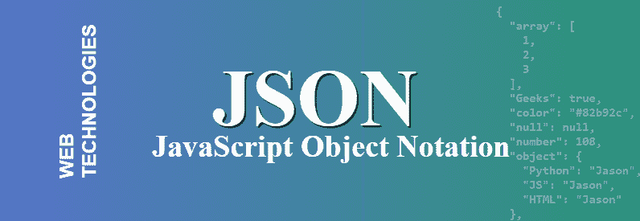

# JSON 全格式

> 原文:[https://www.geeksforgeeks.org/json-full-form/](https://www.geeksforgeeks.org/json-full-form/)



**JSON** 代表 JavaScript 对象符号。它是一种基于文本的数据交换格式，用于维护数据的结构。JSON 是 JSON 中 XML 数据交换格式的替代。与 XML 相比，结构化数据很容易。它支持像数组和对象这样的数据结构，以及在服务器上快速执行的 JSON 文档。它也是一种独立于语言的格式，来源于 JavaScript。JSON 的官方媒体类型是`application/json`，保存那些文件**。json** 分机。

JSON 最初是由道格拉斯·克洛克福特在 2000 年代初创建的，在 2013 年首次标准化，之后在 2007 年 JSON 的最新标准发布。

**语法:**

```
{
  "Name": "GeeksforGeeks",
  "Estd": 2009,
  "age": 10,
  "address": {
    "buildingAddress": "5th & 6th Floor Royal Kapsons, A- 118",
    "city": "Sector- 136, Noida",
    "state": "Uttar Pradesh (201305)",
    "postalCode": "201305"
  },
```

**JSON 的特性:**

*   **通俗易懂:** JSON 易读易写。
*   **格式:**是基于文本的交换格式。它可以将任何类型的数据存储在视频、音频和图像的数组中。
*   **支持:**重量轻，几乎所有语言和 OS 都支持。它对浏览器有广泛的支持，大约每个浏览器都受 JSON 支持。
*   **依存性:**它是一种基于文本的独立语言。与其他基于文本的结构化数据相比，它要快得多。

**JSON 的优势:**

*   JSON 将所有数据存储在一个数组中，因此数据传输更加容易。这就是为什么 JSON 最适合共享任何大小的数据，甚至是音频、视频等。
*   它的语法非常容易使用。它的语法非常小且轻量级，这就是它以更快的方式执行和响应的原因。
*   JSON 具有广泛的浏览器支持与操作系统的兼容性，不需要太多努力就能使其与所有浏览器兼容。
*   在服务器端解析这是开发人员想要的最重要的部分，如果解析在服务器端很快，那么用户可以得到快速的响应，所以在这种情况下，JSON 服务器端解析是与其他解析相比的强项。

**JSON 的缺点:**

*   JSON 的主要缺点是 JSON 中没有错误处理，如果 JSON 脚本中有一个小错误，那么您将无法获得结构化数据。
*   当你在一些未经授权的浏览器上使用 JSON 时，它变得相当危险。就像 JSON 服务返回一个用函数调用包装的 JSON 文件，浏览器必须执行这个函数调用。如果浏览器未经授权，那么你的数据就会被黑客攻击。
*   JSON 有有限的支持工具，我们可以在 JSON 开发过程中使用。