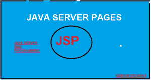

# JSP 完整表单

> 原文:[https://www.geeksforgeeks.org/jsp-full-form/](https://www.geeksforgeeks.org/jsp-full-form/)

JSP 代表 Java 服务器页面。这是一个在应用服务器端使用的编程工具。JSP 基本上用于支持平台无关的动态方法来构建依赖于网络的应用程序。JSP 页面类似于 ASP 页面，因为它们是在服务器上编译的，而不是在用户的网络浏览器上。

JSP 是由太阳微系统公司在 1999 年开发的。对于 JSP 的开发，使用的语言是所有内置于其中的功能都是用 Java 编程语言创建的。

**JSP**的特点:

*   JSP 是 Servlet 技术的扩展版本。
*   JSP 技术类似于 Servlet 应用程序接口(API)。
*   它提供了一些额外的功能，如表达语言和自定义标签等。
*   JSP 文件更容易部署，因为 JSP 引擎会自动执行 Java 代码的重新编译。

**JSP 的优势:**

JSP 有很多优点。

*   **Extension to Servlet:**

    Servlet 的 JSP 扩展。我们可以在 JSP 中使用 Servlet 的所有特性。我们可以轻松使用 JSP 开发的隐式对象、预定义标签、定制标签和表达式语言。

    *   **Easy To Maintain:**

        它很容易管理，因为我们可以很容易地分离我们的业务逻辑，在 Servlet 技术中，我们可以将我们的业务逻辑与表示逻辑混合在一起。

        *   **Fast Development:**

            不需要重新编译和重新部署。如果 JSP 页面被修改。我们不需要重新编译和重新部署项目。如果我们想改变应用程序的外观和感觉，Servlet 代码需要重新编译和更新。

            *   **Less Code than Servlet: **

                在 JSP 中，我们可以使用大量的标签，如动作标签、jstt、自定义标签等来减少代码。我们可以更多地使用电致发光和隐式对象。

            *   **JSP 页面代码在客户端不可见，只有生成的 HTML 可见。**

        **JSP 的劣势:**

        *   很难调试或跟踪错误，因为 JSP 页面在编译过程之前首先被翻译成 servlets。
        *   由于 JSP 页面被翻译成 Servlets 并编译，很难跟踪 JSP 页面中出现的错误。
        *   数据库连接并不容易。
        *   JSP 页面需要更多的磁盘空间来保存 JSP 页面。
        *   首次访问 JSP 页面需要更多的时间，因为它们要在服务器上编译。

        **JSP 的用途:**

        *   JSP 有很多优点。首先，动态部分是用 Java 写的，不是 Visual Basic 或者其他 MS 特有的语言，所以功能更强大，更容易使用。
        *   它对于非微软的网络服务器和其他操作系统是独立于平台的
        *   JSP 帮助开发人员利用特殊的 JSP 标签在 HTML 页面中插入 Java 代码
        *   JSP 也可以用来访问 JavaBeans 对象。JSP 允许使用请求和响应对象跨页面共享信息。
        *   它可以用于分离 web 应用程序中的视图层和业务逻辑