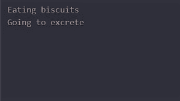

# JavaScript 中有哪些类组成？

> 原文:[https://www . geesforgeks . org/什么是 javascript 中的类组合/](https://www.geeksforgeeks.org/what-are-the-class-compositions-in-javascript/)

组合有助于通过组合小函数来创建大而复杂的函数。例如，你可以在小砖块的帮助下建一堵墙。砖的例子可以看作是一种功能，而组合就是我们如何组合这些砖来建造一堵墙。类组合为我们提供了一种简单的组合方式，包括用面向对象编程进行组合的好处。

可以合成*类*和*对象*。一个类可以被认为是一个对象的“蓝图”，对象是一个具有相关功能和数据(方法和状态)的实体。根据需要，它可以用来创建许多对象。

通过使用**混合**概念，属性将被添加到对象中，而不使用继承。不同对象的属性混合到一个对象中，因此该对象拥有该对象的所有属性和方法。换句话说，一个**混搭**是一种给出实现某种行为的方法的方式。它用于添加其他类的行为。

**注意:****混合**技术定义了行为的一部分，它由一个工厂函数组成，该函数以一个*超类*为参数，并返回相应的子类。

**示例:**创建一个 mixin 类，并使用它开发一个“人类”类示例。

```
// Create a mixin class
const MixFood = superclass => class extends superclass {
    eating(food) {
        console.log(`Eating ${food}`);
    }

    excrete() {
        console.log("Going to excrete");
    }
};

// Develop the "Child" example by 
// enhancing the "Human" class 
class Human {
    constructor(name) {
        this.name = name
    }
}

class Child extends MixFood(Human) {
    constructor(...args) {
        super(...args)
    }

    cry() {
        console.log("Woff woff!")
    }

    lunch(food) {
        this.eating(food);
        this.excrete();
    }
}

const john = new Child("jack");
john.lunch("biscuits");
```

**输出:**
