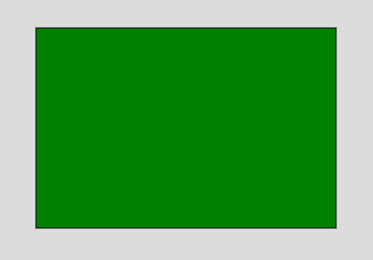

# p5.js | draw()功能

> 原文:[https://www.geeksforgeeks.org/p5-js-draw-function/](https://www.geeksforgeeks.org/p5-js-draw-function/)

设置()函数后调用 **draw()函数**。draw()函数用于执行块内的代码，直到程序停止或调用 noLoop()为止。如果程序在 setup()函数中不包含 noLoop()函数，那么 draw()函数在停止前仍将执行一次。它应该总是用 noLoop()，redraw()和 Loop()函数来控制。

**语法:**

```
draw()
```

下面的例子说明了 p5.js 中的 draw()函数:

**例 1:**

```
function setup() { 

    // Create Canvas of given size 
    createCanvas(400, 300); 
} 

function draw() { 

    background(220); 

    // Use color() function 
    let c = color('green'); 

    // Use fill() function to fill color 
    fill(c); 

    // Draw a rectangle 
    rect(50, 50, 300, 200); 

} 
```

**输出:**


**例 2:**

```
function setup() {  

    // Create Canvas of given size 
    var cvs = createCanvas(600, 250);
}

function draw() {

    // Set the background color
    background('green'); 

    // Use createDiv() function to
    // create a div element
    var myDiv = createDiv('GeeksforGeeks');

    var myDiv1 = createDiv('A computer science portal for geeks');

    // Use child() function
    myDiv.child(myDiv1);

    // Set the position of div element
    myDiv.position(150, 100);  

    myDiv.style('text-align', 'center');

    // Set the font-size of text
    myDiv.style('font-size', '24px');

    // Set the font color
    myDiv.style('color', 'white');

}
```

**输出:**
