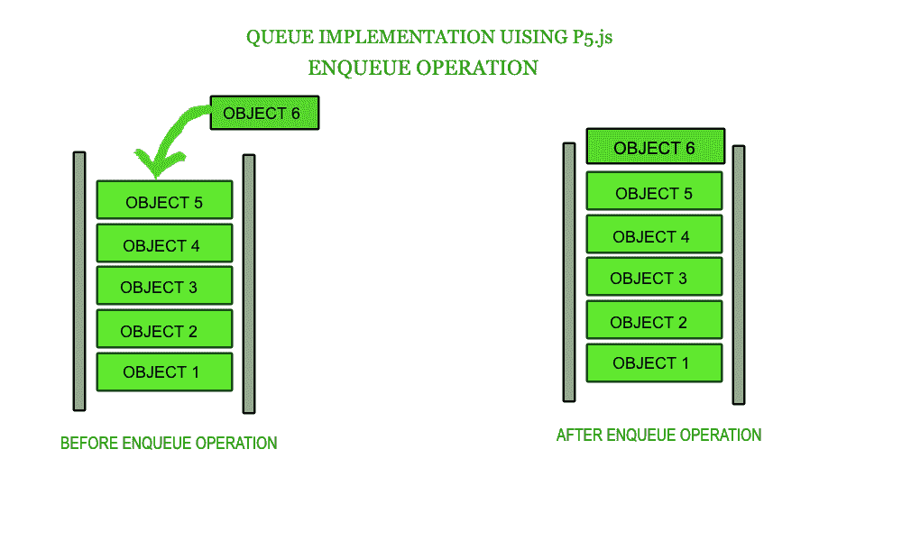

# p5.js |队列中的入队操作

> 原文:[https://www . geesforgeks . org/P5-js-enqueue-operation-in-queue/](https://www.geeksforgeeks.org/p5-js-enqueue-operation-in-queue/)

**什么是队列？**
队列是一种线性结构，它遵循执行操作的特定顺序。顺序是先进先出。队列的一个很好的例子是资源的任何消费者队列，其中先到的消费者先被服务。在队列中添加或移除元素需要恒定的时间。


当我们需要处理**先进先出**形式的数据时，应该在数组上使用队列。
**队列限制:**一次只能访问一个元素。



在 JavaScript 中，数组有像 pop 和 shift 这样的方法来定义 Queue 类:入队和出队操作。这样，队列就可以很容易地实现。
**队列的基本骨架:**下面的例子运行使用“$node skeleton.js”命令获取基本队列骨架。

## java 描述语言

```
// Define Queue function
function Queue(array) {
    this.array = [];
    if (array) this.array = array;
}

// Add Get Buffer property to object
// constructor which slices the array
Queue.prototype.getBuffer = function() {
    return this.array.slice();
}

// Add isEmpty properties to object constructor
// which returns the length of the array
Queue.prototype.isEmpty = function() {
    return this.array.length == 0;
}

// Instance of the Queue class
var queue1 = new Queue(); //Queue { array: [] }

console.log(queue1);
```

**例:**

## java 描述语言

```
<!DOCTYPE html>
<html>

<head>
    <title>Enqueue Operation</title>

    <meta charset="UTF-8">

    <script src=
"https://cdnjs.cloudflare.com/ajax/libs/p5.js/0.8.0/p5.min.js"
    type="text/javascript"></script>

    <style>
        body {
            padding: 0;
            margin: 0;
        }
        canvas {
            vertical-align: top;
        }
    </style>
</head>

<body>   
    <script>

        // Define Queue function
        function Queue(array) {
            this.array = [];
            if (array) this.array = array;
        }

        // Add Get Buffer property to object
        // constructor which slices the array
        Queue.prototype.getBuffer = function() {
            return this.array.slice();
        }

        // Add isEmpty properties to object constructor
        // which returns the length of the array
        Queue.prototype.isEmpty = function() {
            return this.array.length == 0;
        }

        // Instance of the Queue class
        var queue1 = new Queue(); // Queue { array: [] }

        console.log(queue1);

        // Add Push property to object constructor
        // which push elements to the array
        Queue.prototype.enqueue = function(value) {
            this.array.push(value);
        }

        function setup() {

            // Create Canvas of size display width * 300
            createCanvas(displayWidth, 300);
        }

        function draw() {

            // Set background color
            background("grey");

            // Set stroke weight
            strokeWeight(3);
            textAlign(CENTER);
            textSize(24);
            text("Queue Implementation Using P5.js",
                        windowWidth/2, 20);
            textAlign(LEFT);
            textSize(14);

            // Set stroke color
            stroke('green');
            line(10, 45, 90, 45);
            rect(10, 30, 60, 30);
            noStroke();
            text("FRONT", 20, 50);

            // Display queue
            for(var i = 0; i <= queue1['array'].length-1; i++) {
                var p = 10;
                translate(70, 0);
                strokeWeight(3);
                stroke('green');
                line(10+p, 45, p+80, 45);

                rect(10+p, 30, 40+p, 30);
                noStroke();
                text(queue1['array'][i], 40, 50);
                p += 10;
            }

            // Set stroke color
            stroke('green');
            translate(70, 0);
            rect(10, 30, 60, 30);
            noStroke();
            text("REAR", 20, 50);
        }

        // Peek Function
        Queue.prototype.peek = function() {
            return this.array[this.array.length-1];
        }

        // Driver Code
        // Call to Enqueue operation
        queue1.enqueue(1);
        queue1.enqueue(2);
        queue1.enqueue(3);
        queue1.enqueue(19);
        queue1.enqueue(11);
        queue1.enqueue(15);
        queue1.enqueue(14);
        queue1.enqueue(18);
    </script>
</body>

</html>                                   
```

**输出:**


通过调用 *queue1 将‘25’入队后，后方的入队(25)* 功能变为 25。

