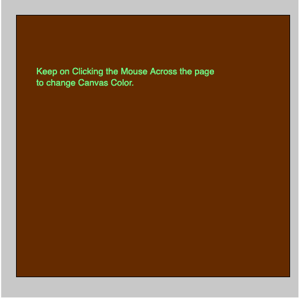
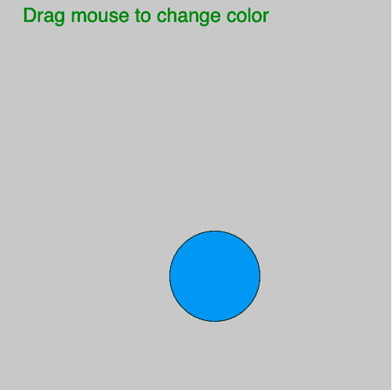

# p5.js mousePressed()功能

> 原文:[https://www.geeksforgeeks.org/p5-js-mousepressed-function/](https://www.geeksforgeeks.org/p5-js-mousepressed-function/)

p5.js 中的 **mousePressed()函数**在鼠标点击文档时工作。mouseButton 变量用于指定按下哪个按钮。如果未定义鼠标按下()功能，则使用**触摸开始()**功能代替鼠标按下()功能。

**语法:**

```
mousePressed(Event)
```

下面的程序说明了 p5.js 中的 mousePressed()函数:

**示例 1:** 本示例使用 mousePressed()函数。

```
function setup() {

    // Create Canvas
    createCanvas(500, 500);
}

let value = 0;

function draw() {

    // Set background color
    background(200);

    // Fill the color
    fill(value, value-50, value-100);

    // Create rectangle
    rect(25, 25, 460, 440);

    // Set the color of text
    fill('lightgreen');

    // Set font size
    textSize(15);

    // Display content
    text('Keep on Clicking the Mouse Across'
        + 'the page \nto change Canvas Color.',
            windowHeight/10, windowWidth/4);
}

function mousePressed() {

    value = value + 5;

    if (value > 255) {
        value = 0;
    }
}
```

**输出:**


**例 2:**

```
let valueX;
let valueY;

function setup() {

    // Create Canvas
    createCanvas(500, 500);
}

function draw() {

    // Set background color
    background(200); 

    // Set the text color
    fill('green');

    // Set text size
    textSize(25);

    text('Drag mouse to change color', 30, 30);

    // Fill color according to mouseMoved() 
    fill(valueX, 255-valueY, 255-valueX);

    // Draw ellipse  
    ellipse(mouseX, mouseY, 115, 115);
}

function mousePressed() {
    valueX = mouseX%255;
    valueY = mouseY%255;
}
```

**输出:**


**参考:**T2】https://p5js.org/reference/#/p5/mousePressed