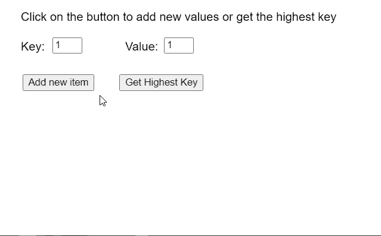
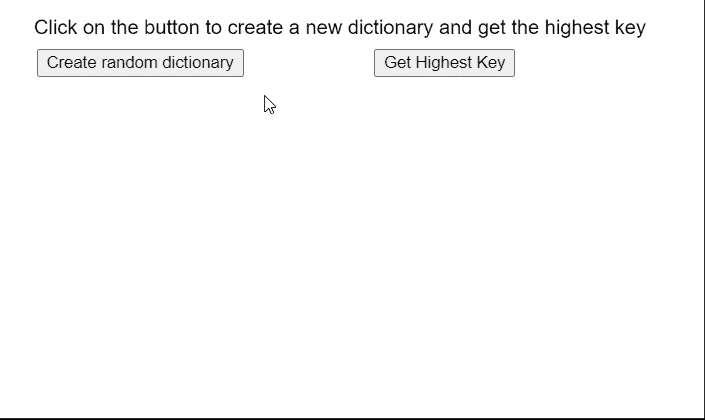

# p5.js NumberDict maxKey()方法

> 原文:[https://www . geesforgeks . org/P5-js-numberdict-maxkey-method/](https://www.geeksforgeeks.org/p5-js-numberdict-maxkey-method/)

p5 的 **maxKey()** **法**。p5.js 中的 NumberDict 用于查找数字字典中最高的键值。键值对是相互映射的两个值的集合。这些值可以通过使用对的关键字部分查询字典来访问。数字字典可以存储多个键值对，可以使用字典的方法访问这些键值对。

**语法:**

```
maxKey()
```

**参数:**此功能不接受任何参数。

**返回值:**返回一个数字值，该值是数字字典中最高的键。

下面的例子说明了 p5.js 中的 **maxKey()方法**:

**例 1:**

## java 描述语言

```
function setup() {
  createCanvas(500, 300);
  textSize(16);

  text("Click on the button to add new " +
       "values or get the highest key",
       20, 20);

  text("Key:", 20, 60);
  text("Value:", 160, 60);

  key_input = createInput('1');
  key_input.position(70, 50);
  key_input.size(40);

  val_input = createInput('1');
  val_input.position(220, 50);
  val_input.size(40);

  setBtn = createButton("Add new item");
  setBtn.position(30, 100);
  setBtn.mouseClicked(addtoDict);

  getBtn = createButton("Get Highest Key");
  getBtn.position(160, 100);
  getBtn.mouseClicked(getHighestKey);

  // Create a Number Dictionary initially
  numDict = createNumberDict(100, 0);
}

function addtoDict() {
  clear();

  let key = int(key_input.value());
  let val = int(val_input.value());

  numDict.set(key, val);

  text("New key-value added to dictionary",
       20, 160);

  text("Key:", 20, 60);
  text("Value:", 160, 60);
  text("Click on the button to add new " +
       "values or get the highest key",
       20, 20);
}

function getHighestKey() {

  // Get the highest key in the dictionary
  let highestKey = numDict.maxKey();

  // Display the highest key
  text("The highest key in the dictionary is: " +
       highestKey, 20, 200);

  text("Key:", 20, 60);
  text("Value:", 160, 60);
  text("Click on the button to add new " +
       "values or get the highest key",
       20, 20);
}
```

**输出:**



**例 2:**

## java 描述语言

```
function setup() {
  createCanvas(550, 300);
  textSize(16);

  text("Click on the button to create a " +
       "new dictionary and get the highest key",
       20, 20);

  setBtn = 
    createButton("Create random dictionary");
  setBtn.position(30, 40);
  setBtn.mouseClicked(createNewDict);

  getBtn = createButton("Get Highest Key");
  getBtn.position(300, 40);
  getBtn.mouseClicked(getHighestKey);
}

function createNewDict() {
  clear();

  // Create an object with random values
  let obj = {};
  for (let i = 0; i < 5; i++) {
    let rk = ceil(Math.random() * 100);
    let rn = floor(Math.random() * 100);
    obj[rk] = rn;

    text("Key: " + rk + " : Value: " +
         rn, 40, 120 + 20 * i);
  }

  // Create a number dict using
  // the above values
  numDict = createNumberDict(obj);

  text("New Dictionary created with values",
       20, 80);

  text("Click on the button to create a " +
       "new dictionary and get the highest key",
       20, 20);
}

function getHighestKey() {

  // Get the highest key in the dictionary
  let highestKey = numDict.maxKey();

  // Display the lowest key
  text("The highest key in the dictionary is: " +
       highestKey, 20, 240);

  text("Click on the button to create a " +
       "new dictionary and get the highest key",
       20, 20);
}
```

**输出:**



**在线编辑:**[【https://editor.p5js.org/】](https://editor.p5js.org/)
**环境设置:**[https://www . geeksforgeeks . org/P5-js-soundfile-object-installation-and-methods/](https://www.geeksforgeeks.org/p5-js-soundfile-object-installation-and-methods/)
**参考:**[https://p5js.org/reference/#/p5.NumberDict/maxKey](https://p5js.org/reference/#/p5.NumberDict/maxKey)