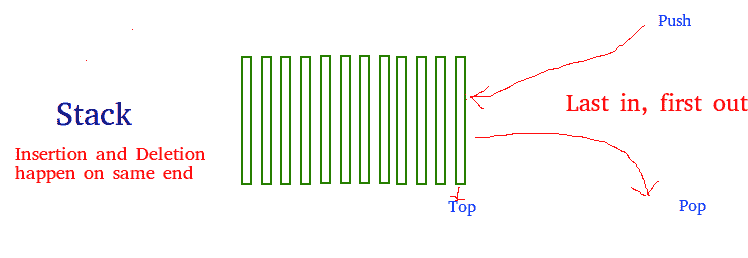

# p5.js |堆栈上的推送操作

> 原文:[https://www . geesforgeks . org/P5-js-push-operation-on-stack/](https://www.geeksforgeeks.org/p5-js-push-operation-on-stack/)

**什么是 Stack？**
堆栈是一个线性数据结构，就像一个数组，其中只有最后插入的元素可以被访问。这种数据结构适用于后进先出原则。它非常快，因为它必须只访问最后添加的元素，所以它需要恒定的时间来这样做，具有复杂性 **O(1)** 。当我们需要处理**后进先出**形式的数据时，堆栈应该在数组上使用。堆栈上的推送操作用于在堆栈中添加一项。如果堆栈已满，则称为溢出情况。



**栈的基本骨架:**下面的例子使用“$node skeleton.js”命令运行得到基本栈骨架。

## java 描述语言

```
// Define Stack function
function Stack(array) {
    this.array = [];
    if (array) this.array = array;
}

// Add Get Buffer property to object
// constructor which slices the array
Stack.prototype.getBuffer = function() {
    return this.array.slice();
}

// Add isEmpty properties to object constructor
// which returns the length of the array
Stack.prototype.isEmpty = function() {
    return this.array.length == 0;
}

// Instance of the stack class
var stack1 = new Stack(); // Stack { array: [] }

console.log(stack1);
```