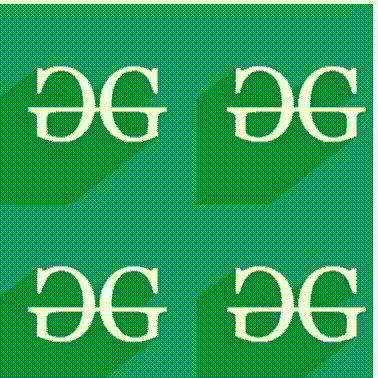

# p5.js textureWrap()方法

> 原文:[https://www.geeksforgeeks.org/p5-js-texturewrap-method/](https://www.geeksforgeeks.org/p5-js-texturewrap-method/)

p5.js 中的 **textureWrap()功能**用于设置全局纹理环绕模式。当纹理超出正常范围时，它可以用来设置纹理的行为。它有三种模式:

*   CLAP**模式使纹理边缘的像素扩展到极限。这是默认行为。**
*   **重复模式使纹理重复平铺，直到达到极限。**
*   **MIRROR 模式的工作方式类似于 REPEAT，但它会反转每个新图块上的纹理。**

**只有当纹理大小是 2 的幂时，REPEAT 和 MIRROR 才有效。在下一次调用该函数之前，这些更改一直有效。**

****语法:****

```
textureWrap(wrapX, [wrapY])
```

****参数:** 该功能接受两个参数，如上所述，描述如下:**

*   ****wrapX:** 这是一个常量，设置 x 方向纹理环绕的模式。它可以有“夹钳”、“重复”或“镜像”值。默认为 CLAMP 模式。**
*   ****wrapY:** 这是一个常量，用于设置 y 方向的纹理环绕模式。它可以有“夹钳”、“重复”或“镜像”值。这是一个可选参数。**

**下面的例子说明了 p5.js 中的 **textureWrap()函数**:**

****示例 1:** 使用夹钳模式进行纹理环绕。**

## **java 描述语言**

```
let img;

function preload() {
  img = loadImage('images/gfg.jpg');
}

function setup() {
  createCanvas(300, 300, WEBGL);

  // Set the texture wrapping mode
  // to CLAMP
  textureWrap(CLAMP);
}

function draw() {
  background(0);

  let dX = mouseX;
  let dY = mouseY;

  let u = lerp(1.0, 2.0, dX);
  let v = lerp(1.0, 2.0, dY);

  scale(width / 2);

  texture(img);

  beginShape();
  vertex(-1, -1, 0, 0, 0);
  vertex(1, -1, 0, u, 0);
  vertex(1, 1, 0, u, v);

  vertex(1, 1, 0, u, v);
  vertex(-1, 1, 0, 0, v);
  vertex(-1, -1, 0, 0, 0);

  endShape();
}
```

****输出:****

****

****示例 2:** 使用镜像模式进行纹理环绕。**

## **java 描述语言**

```
let img;
function preload() {
  img = loadImage('images/gfg.jpg');
}

function setup() {
  createCanvas(300, 300, WEBGL);

  // Set the texture wrapping mode
  // to MIRROR
  textureWrap(MIRROR);
}

function draw() {
  background(0);

  let dX = mouseX;
  let dY = mouseY;

  let u = lerp(1.0, 2.0, dX);
  let v = lerp(1.0, 2.0, dY);

  scale(width / 2);

  texture(img);

  beginShape();
  vertex(-1, -1, 0, 0, 0);
  vertex(1, -1, 0, u, 0);
  vertex(1, 1, 0, u, v);

  vertex(1, 1, 0, u, v);
  vertex(-1, 1, 0, 0, v);
  vertex(-1, -1, 0, 0, 0);

  endShape();
}
```

****输出:****

****

****示例 3:** 使用重复模式进行纹理环绕。**

## **java 描述语言**

```
let img;
function preload() {
  img = loadImage('images/gfg.jpg');
}

function setup() {
  createCanvas(300, 300, WEBGL);

  // Set the texture wrapping mode
  // to REPEAT
  textureWrap(REPEAT);
}

function draw() {
  background(0);

  let dX = mouseX;
  let dY = mouseY;

  let u = lerp(1.0, 2.0, dX);
  let v = lerp(1.0, 2.0, dY);

  scale(width / 2);

  texture(img);

  beginShape();
  vertex(-1, -1, 0, 0, 0);
  vertex(1, -1, 0, u, 0);
  vertex(1, 1, 0, u, v);

  vertex(1, 1, 0, u, v);
  vertex(-1, 1, 0, 0, v);
  vertex(-1, -1, 0, 0, 0);

  endShape();
}
```

****输出:****

**
**参考:**[https://p5js.org/reference/#/p5/textureWrap](https://p5js.org/reference/#/p5/textureWrap)**