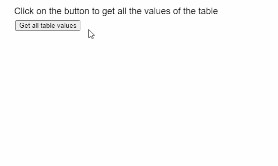

# p5。表获取()方法

> 原文:[https://www.geeksforgeeks.org/p5-table-get-method/](https://www.geeksforgeeks.org/p5-table-get-method/)

p5 的 **get()方法**。p5.js 中的 Table 用于从表的给定行和列中检索值。行可以由行标识指定，列可以由其列标识或列名指定。

**语法:**

```
get( row, column )

```

**参数:**该方法接受两个参数，如上所述，如下所述:

*   **行:**是表示该行的行标识的数字。
*   **列:**是表示列名或列标识的字符串或数字。

**返回值:**此方法返回从表的给定行和列中检索的字符串或数字值。

下面的例子说明了 p5.js 中的 **get()方法**:

**例 1:**

## java 描述语言

```
function setup() {
  createCanvas(500, 300);
  textSize(18);

  text("Click on the button to get all " + 
       "the values of the table", 20, 20);

  setBtn = createButton("Get all table values");
  setBtn.position(30, 40);
  setBtn.mouseClicked(showTable);

  // Create the table
  table = new p5.Table();

  setTableData();
}

function setTableData() {

  // Add 5 columns and rows to the table
  for (let i = 0; i < 5; i++) {
    table.addColumn("Column " + i);
    table.addRow();
  }

  for (let r = 0; r < 5; r++) {
    for (let c = 0; c < 5; c++) {

      // Set the value at the given
      // column and row of the table
      table.set(r, c, r + " " + c);
    }
  }
}

function showTable() {
  clear();
  text("The values of the table are retrieved " +
       "using the get() method", 20, 20);

  // Show all the columns present
  for (let c = 0; c < 5; c++) {
    text(table.columns, 20 + 100 * c, 80);
  }

  // Show all the rows currently
  // present in the table
  for (let r = 0; r < 5; r++) {
    for (let c = 0; c < 5; c++) {

      // Get the value at the given row
      // and column
      text(table.get(r, c),
          20 + 100 * c,
          100 + 20 * r);
    }
  }
}
```

**输出:**



**例 2:**

## java 描述语言

```
function setup() {
  createCanvas(500, 300);
  textSize(18);

  text("Click on the button to get " + 
       "that value in the table", 20, 20);

  text("Enter row and column", 20, 60);

  rowInp = createInput();
  rowInp.position(30, 80);
  rowInp.size(30, 20);

  colInp = createInput();
  colInp.position(70, 80);
  colInp.size(30, 20);

  setBtn =
    createButton("Get value at row and column");
  setBtn.position(30, 110);
  setBtn.mouseClicked(getValueAt);

  // Create the table
  table = new p5.Table();

  setTableData()
}

function setTableData() {

  // Add 5 columns and rows to the table
  for (let i = 0; i < 5; i++) {
    table.addColumn("Column " + i);
    table.addRow();
  }

  for (let r = 0; r < 5; r++) {
    for (let c = 0; c < 5; c++) {

      // Set the value at the given
      // column and row of the table
      table.set(r, c, r + " " + c);
    }
  }
}

function getValueAt() {
  clear();
  let rowToGet = int(rowInp.value());
  let colToGet = int(colInp.value());

  if (rowToGet < table.getRowCount() &&
      colToGet < table.getColumnCount()) {
    text("The value at row " + rowToGet + 
         " and column " + colToGet + " is:",
         20, 160);

    // Get the value at the given row
    // and column
    text(table.get(rowToGet, colToGet), 20, 180);
  }
  else
    text("Please enter correct row and " +
    "column values", 20, 160);

  text("Click on the button to get that value " + 
       "in the table", 20, 20);
  text("Enter row and column", 20, 60);
}
```

**输出:**


**在线编辑:**[https://editor.p5js.org/](https://editor.p5js.org/)

**环境设置:**

**参考:**T2】https://p5js.org/reference/#/p5.Table/get